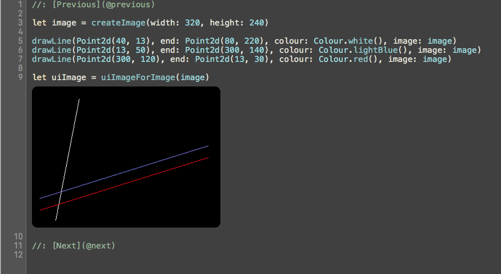

# TinyRenderer Swift

TinyRenderer is a pure software rasteriser implemented in Swift.

The project is split into multiple playgrounds to illustrate various concepts.

### 1. Line Drawing

### 2. Wireframe Rendering

### 3. Triangle Rasterisation

